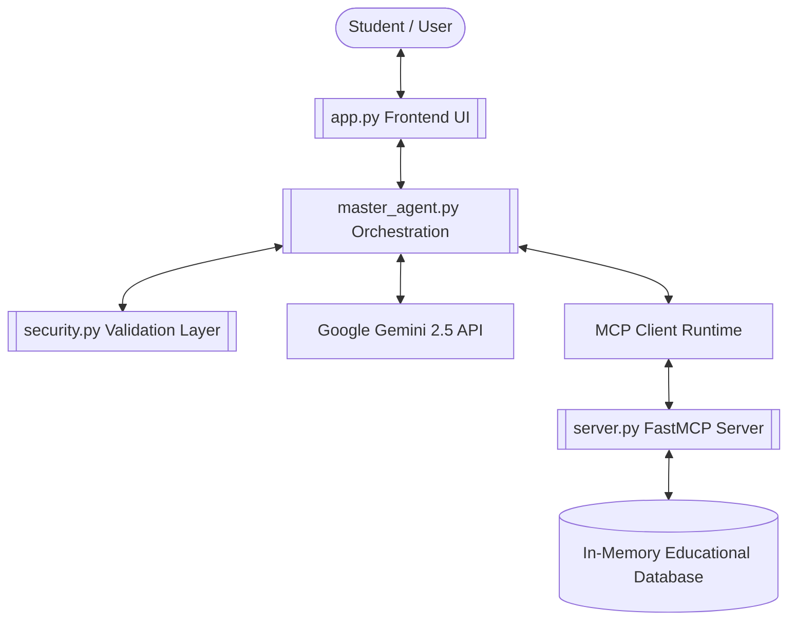
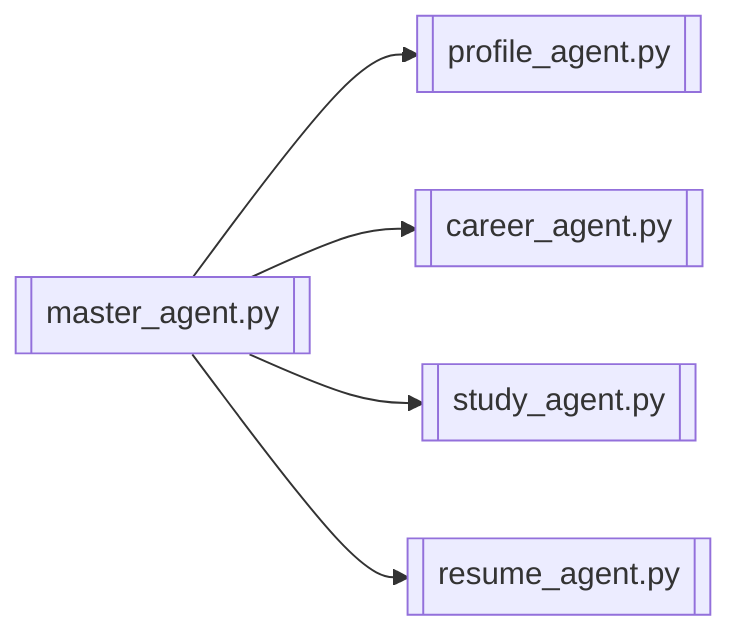
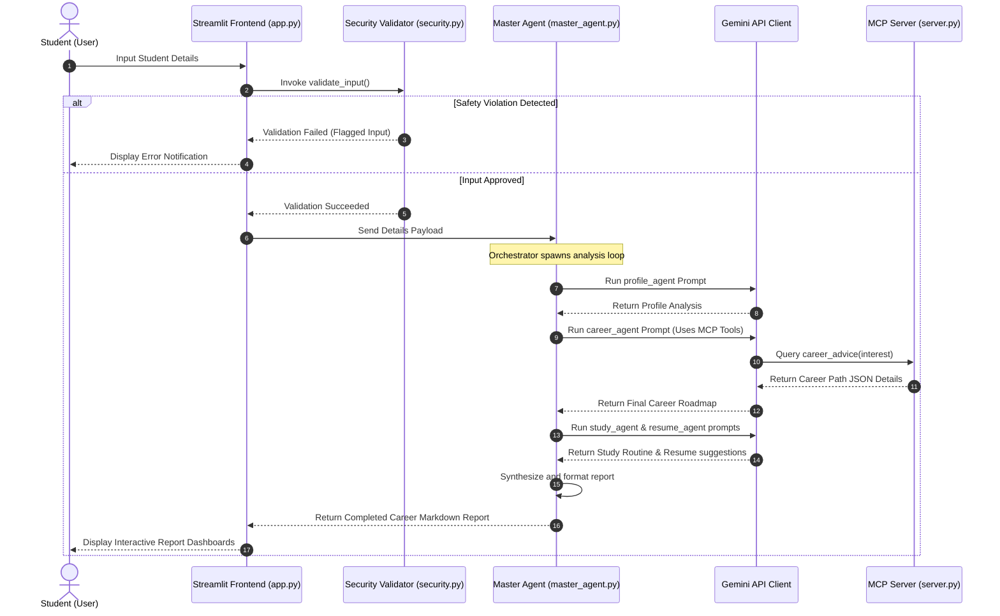
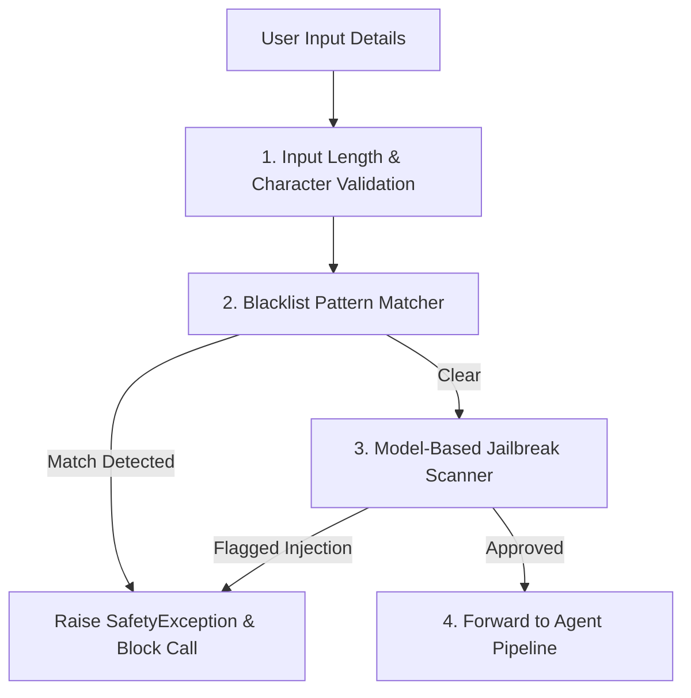
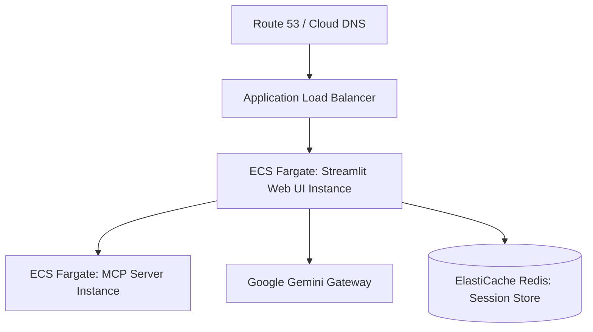

# 🎓 EduPilot AI: System & Agent Architecture Design

Welcome to the **EduPilot AI** system architecture manual. This document describes the modular architecture, multi-agent cooperative pattern, security design, and production deployment layout for the EduPilot AI platform.

---

## 🏗️ 1. System Architecture

EduPilot AI uses a decoupled multi-tier architecture to separate presentation, orchestration, domain logic, and external LLM services.

### Component Details
* **Frontend Web UI ([app.py](file:///C:/Users/Lenovo/EduPilot-AI/frontend/app.py))**: Handles user input parameters, maintains Streamlit session states, and renders visual roadmaps and study schedules.
* **Orchestrator ([master_agent.py](file:///C:/Users/Lenovo/EduPilot-AI/agents/master_agent.py))**: Coordinates control loops and aggregates data returned by the independent AI agents.
* **Security & Guardrail Layer ([security.py](file:///C:/Users/Lenovo/EduPilot-AI/agents/security.py))**: Evaluates incoming query syntax for malicious prompt injection before execution.
* **MCP Tool Server ([server.py](file:///C:/Users/Lenovo/EduPilot-AI/mcp/server.py))**: Standardized FastMCP microservice providing career and study data.
* **Gemini Client ([gemini_client.py](file:///C:/Users/Lenovo/EduPilot-AI/agents/gemini_client.py))**: Standardized SDK integration managing connection parameters, models list, and retry backoffs.

---

## 🤖 2. Agent Architecture

The application adopts a **Cooperative Multi-Agent Pattern**. Specialized sub-agents perform analysis on a specific domain using dedicated prompt policies.

### Agent Directory
* **Profile Agent ([profile_agent.py](file:///C:/Users/Lenovo/EduPilot-AI/agents/profile_agent.py))**: Conducts SWOT analysis, identifies academic milestones, and highlights student skill gaps.
* **Career Agent ([career_agent.py](file:///C:/Users/Lenovo/EduPilot-AI/agents/career_agent.py))**: Maps out long-term milestones, targets certification paths, and recommends projects.
* **Study Agent ([study_agent.py](file:///C:/Users/Lenovo/EduPilot-AI/agents/study_agent.py))**: Structures structured study routines, revision schedules, and time blocks.
* **Resume Agent ([resume_agent.py](file:///C:/Users/Lenovo/EduPilot-AI/agents/resume_agent.py))**: Focuses on professional resumes, formatting corrections, and impact statements.

---

## 🔄 3. Data Flow Architecture

The sequence below details the lifecycle of a student request from input transmission to dashboard rendering:

---

## 🛡️ 4. Security Layer Design

EduPilot AI uses a **Defense-in-Depth** model to intercept malicious inputs, protecting system credentials and core agent prompts.

### Key Security Policies
1. **Keyword Sanitization**: The [`validate_input`](file:///C:/Users/Lenovo/EduPilot-AI/agents/security.py#L1-L13) utility acts as the first line of defense, filtering keywords that match common injection phrases (e.g. `ignore instructions`, `show api key`).
2. **Context Isolation**: System instructions are defined programmatically. Student input is treated strictly as data parameters inside isolated prompts.
3. **Environment Encapsulation**: Credentials, including `GEMINI_API_KEY`, are managed as read-only variables in host environments, never exposed in client sessions or output screens.

---

## 🌐 5. Deployment Architecture

For scalable production workloads, the application utilizes a serverless, containerized cluster topology.

### Production Infrastructure Highlights
* **Orchestration**: Web and MCP servers run as independent, autoscaling **Docker Containers** using AWS ECS Fargate or Google Cloud Run.
* **Caching**: **Redis** cluster manages session memory and caches redundant LLM responses to reduce API billing.
* **Secrets Management**: Secrets are injected during container startup from **AWS Secrets Manager**, preventing key exposure in repository check-ins.
